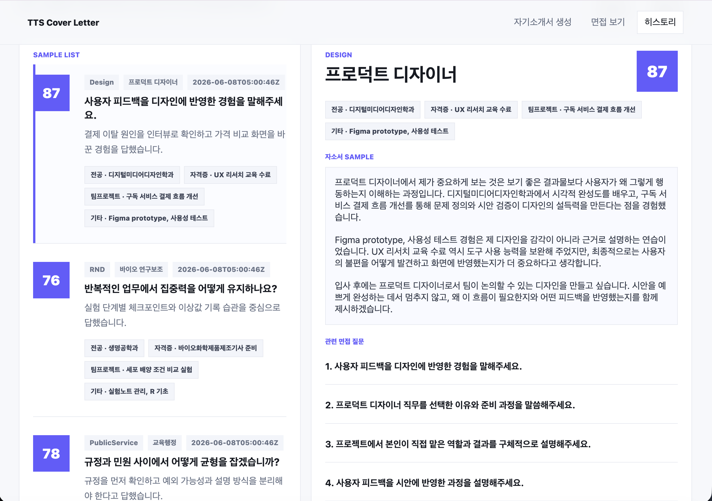

# TTS Cover Letter Dataset

링커리어 합격 자기소개서 데이터를 정리하고, 직무/스펙 카테고리 분류와 시각화까지 생성하는 작업 공간입니다. 최종 원본 데이터는 `linkareer_1to740.csv`이며, 중복 링크와 중복 cover-letter ID를 제거한 상태입니다.

## Result Screen



## 이번 작업에서 중점적으로 한 것

- 자기소개서 생성에서 끝나지 않고, 생성된 자기소개서 내용을 면접 질문과 답변 연습으로 이어지게 했습니다.
- AI Hub 채용면접 라벨링 데이터셋을 로컬 데이터 경로로 연결해 직무별 면접 질문 후보를 가져올 수 있게 했습니다.
- `면접 보기` 화면에 기본 질문, 사용자 맞춤 질문, 데이터셋 기반 질문을 나누고 마이크 답변 입력과 답변 평가 흐름을 추가했습니다.
- SQLite 기반 `history`를 만들어 연습 기록, 자소서 sample, 관련 면접 질문, 답변, 점수를 DB에서 다시 불러오게 했습니다.
- history sample 20개를 직무별로 다르게 구성하고, 5개씩 페이지를 나누어 카드 클릭 시 상세 내용을 확인할 수 있게 했습니다.

## Project Status

### 지금까지 한 것

- 링커리어 합격 자기소개서 데이터를 `linkareer_1to740.csv`로 정리했습니다.
- 중복 링크, 중복 cover-letter ID, 전체 행 중복을 제거해 최종 원본 데이터셋을 만들었습니다.
- 직무 taxonomy를 기준으로 직무 대분류/중분류/소분류 CSV를 생성했습니다.
- 스펙 정보를 학교, 학과, 어학자격증, 기타자격증, 인턴, 기타 항목으로 분리했습니다.
- 카테고리별 분포 요약 CSV와 SVG 시각화 자료를 생성했습니다.
- 자기소개서 본문을 질문 단위 context로 나누어 RAG 검색에 사용할 수 있게 정리했습니다.
- `main.py` 기반 로컬 Web/RAG 서버를 만들고, 브라우저에서 갖고 싶은 직무/직업과 지원자 스펙을 입력해 공통 질문, 자기소개서 초안, 면접 예상 질문을 확인할 수 있게 했습니다.
- 지원자 정보가 비어 있으면 공통 질문, 자기소개서 초안, 면접 준비 질문을 만들지 않도록 처리했습니다.
- 지원자 스펙을 학과/전공, 자격증, 팀프로젝트 작업, 기타 스펙으로 나누어 입력하고, 나이/성별은 면접 데이터셋 비교용 선택 요소로만 남겼습니다.
- 공통 질문별 자기소개서 초안은 1000~1500자 범위를 목표로 생성하며, 문항과 맞지 않는 스펙은 억지로 섞지 않도록 했습니다.
- 검색 결과의 `score`가 BM25 기반 상대 관련도 점수이며 고정 만점이 없다는 안내를 화면과 API 응답에 추가했습니다.
- Vault 스타일을 참고해 좌측 스펙 입력 패널과 우측 결과/이동 섹션 중심의 웹 화면으로 재구성했습니다.
- `frontend/css`, `frontend/js`, `frontend/pages`를 추가해 화면, 스타일, 스크립트, 상세 페이지를 분리했습니다.
- 추후 면접 API 연결을 위한 `api_clients/` 디렉토리와 기본 interview seed POST 클라이언트를 추가했습니다.
- AI Hub 채용면접 라벨 ZIP을 읽는 데이터셋 어댑터를 추가하고, 면접 질문 생성/답변 평가 API를 연결했습니다.
- `DB/history_store.py`와 SQLite history 저장 흐름을 추가해 sample history와 사용자의 면접 연습 기록을 관리할 수 있게 했습니다.
- history 화면에서 20개 sample 자소서와 관련 질문을 5개씩 페이지네이션하고, 클릭한 항목의 상세 내용을 오른쪽에서 확인할 수 있게 했습니다.
- Docker 실행 구성을 추가해 다른 컴퓨터에서도 같은 서버를 실행할 수 있게 했습니다. 자세한 Docker 사용법은 `README_DOCKER.md`를 참고합니다.

### 앞으로 할 것

- STT(Speech-to-Text)를 붙여 사용자가 직접 타이핑하지 않고 말로 지원자 정보를 입력할 수 있게 합니다.
- 음성으로 말한 “내 경험, 스펙, 프로젝트, 지원하고 싶은 회사/직무, 자기소개서에 넣고 싶은 내용”을 텍스트로 변환합니다.
- 변환된 STT 텍스트를 `user_profile`, `target_company`, `target_job`, 검색 query로 정리해 현재 RAG 검색 흐름에 연결합니다.
- 사용자가 말한 내용에서 핵심 경험, 성과 수치, 직무 역량, 지원 동기를 자동으로 분리하는 전처리 단계를 추가합니다.
- STT 입력 결과를 화면에서 사용자가 수정할 수 있게 한 뒤, 수정된 내용을 기준으로 공통 질문, 자기소개서 초안, 면접 예상 질문을 다시 만듭니다.
- 최종적으로는 “말로 입력 -> STT 텍스트 변환 -> 지원자 정보 구조화 -> 직무별 공통 질문 생성 -> 자기소개서 초안 생성 -> 면접 API용 seed 생성 -> 모의 면접” 흐름을 하나의 서비스로 연결합니다.

## Root

- `linkareer_1to740.csv`는 최종 정제본 CSV입니다.
- 컬럼은 `기간, 회사, 직무, 유형, 스펙, 내용, 링크` 순서입니다.
- 현재 기준 데이터는 14,774행이며, 링크/ID/전체 행 중복을 제거했습니다.

## crawler/

- `crawler/crawling.py`는 링커리어 검색/상세 페이지를 수집하고 CSV로 저장하는 크롤러입니다.
- 기존 CSV의 링크를 다시 방문해 본문을 보정하거나, 검색 페이지 범위에서 새 링크를 수집할 수 있습니다.
- 요청 간 delay/jitter, append, workers 옵션을 지원합니다.

## category/

- `category/build_category_csvs.py`는 최종 CSV에서 직무/스펙 분류용 CSV를 생성합니다.
- `category/job_taxonomy.json`은 직무 대분류/중분류/소분류를 계층형 JSON으로 저장한 taxonomy입니다.
- `category/visualize_categories.py`는 카테고리별 요약 CSV와 SVG 차트를 생성합니다.

## categories/

- `categories/직무_카테고리.csv`는 각 행의 직무를 taxonomy 기준으로 1차 자동 분류한 파일입니다.
- `categories/스펙_카테고리.csv`는 스펙을 학교/학과/어학자격증/기타자격증/인턴/기타로 펼친 파일입니다.
- `categories/visualizations/`에는 열별 분포 요약 CSV, SVG 차트, 한 번에 볼 수 있는 `index.html`이 있습니다.

## Web/RAG Server

`main.py`는 로컬 웹 화면과 RAG API를 함께 제공하는 HTTP 서버입니다.

- `/`: 브라우저에서 사용하는 스펙 입력 및 준비 결과 홈 화면입니다.
- `/pages/cover-letter.html`: 생성된 자기소개서 초안을 문항별로 확인하는 화면입니다.
- `/pages/interview.html`: 자기소개서 기반 면접 질문을 확인하는 화면입니다.
- `/pages/history.html`: 저장된 면접 연습 기록과 sample 자소서, 관련 면접 질문을 확인하는 화면입니다.
- `/health`: 서버 상태 확인용 엔드포인트입니다.
- `/api/categories`: 직무 대분류/중분류/소분류별 데이터 개수를 반환합니다.
- `/api/prepare`: 원하는 직무/직업과 지원자 스펙을 받아 공통 질문, 자기소개서 초안, 면접 예상 질문, 추후 면접 API용 seed를 반환합니다.
- `/api/interview/status`: 연결된 AI Hub 면접 데이터셋 상태를 반환합니다.
- `/api/interview/questions`: 기본/사용자 맞춤/데이터셋 기반 면접 질문을 반환합니다.
- `/api/interview/evaluate`: 사용자의 면접 답변을 기준표에 맞춰 평가합니다.
- `/api/history`: 면접 연습 history를 조회하거나 새 기록을 저장합니다.
- `/api/rag`: 기존 호출 호환용 엔드포인트이며 `/api/prepare`와 같은 응답을 반환합니다.

프론트엔드는 아래처럼 분리되어 있습니다.

- `frontend/index.html`: 좌측 스펙 입력 article과 우측 결과/이동 섹션이 있는 첫 화면입니다.
- `frontend/pages/cover-letter.html`: 자기소개서 생성 상세 페이지입니다.
- `frontend/pages/interview.html`: 면접 보기 상세 페이지입니다.
- `frontend/pages/history.html`: 면접 history 상세 확인 페이지입니다.
- `frontend/css/app.css`: 웹 화면 전체 스타일입니다.
- `frontend/js/app.js`: 카테고리 로딩, RAG 호출, 세션 결과 저장, 면접 녹음/평가, history 렌더링을 담당합니다.

외부 면접 API를 붙일 때는 `api_clients/interview_api.py`의 `post_interview_seed()`에 endpoint와 API key를 넘겨 `/api/prepare`가 만든 `interview_api_seed`를 전달하는 방식으로 확장합니다.

`interview_api_seed`에는 `demographic_options`가 포함됩니다. `age`, `gender`는 사용자가 선택한 경우에만 면접 데이터셋 비교 필터로 사용할 수 있고, 자기소개서 본문 생성 근거로는 사용하지 않는다는 사용 규칙을 함께 전달합니다.

현재 서버는 `linkareer_1to740.csv`, `categories/직무_카테고리.csv`, `Embedding/question_contexts.csv`를 읽어서 동작합니다. `Embedding/question_contexts.csv`가 있으면 질문 단위 데이터셋을 우선 사용하고, 없으면 원본 CSV와 직무 카테고리 CSV를 조합해서 문서 단위로 검색합니다.

공통 질문, 자기소개서 초안, 면접 준비 질문은 지원자 정보가 입력된 경우에만 생성됩니다. 지원자 정보가 비어 있으면 화면과 API 모두 준비 결과를 만들지 않고 입력 안내만 반환합니다.

검색 결과의 `score`는 BM25 기반 관련도 점수입니다. 고정된 만점이 있는 점수가 아니라 같은 검색 결과 안에서 상대적으로 높을수록 더 유사하다는 뜻입니다.

context 길이 실험은 아래 명령으로 다시 실행할 수 있습니다. 현재 페르소나 실험 결과 기준으로는 `context_300 + token_bigram` 조합이 가장 안정적입니다.

```bash
python3 -m Embedding.persona_context_experiment --max-docs 12000
```

### Local Run

프로젝트 루트에서 실행합니다.

```bash
python3 main.py --host 127.0.0.1 --port 8000
```

브라우저에서 아래 주소로 접속합니다.

```text
http://127.0.0.1:8000
```

다른 기기에서 같은 네트워크로 접속해야 한다면 서버를 `0.0.0.0`으로 열고, 접속하는 쪽에서는 서버 컴퓨터의 IP를 사용합니다.

```bash
python3 main.py --host 0.0.0.0 --port 8000
```

예를 들어 서버 컴퓨터 IP가 `192.168.0.25`라면 다른 기기 브라우저에서 `http://192.168.0.25:8000`으로 접속합니다. macOS 방화벽이나 회사/학교 네트워크 정책이 있으면 8000번 포트 접속이 막힐 수 있습니다.

서버 상태만 빠르게 확인할 때는 아래 명령을 사용합니다.

```bash
curl http://127.0.0.1:8000/health
```

정상 응답 예시는 다음과 같습니다.

```json
{"status": "ok"}
```

### API Example

```bash
curl -X POST http://127.0.0.1:8000/api/prepare \
  -H 'Content-Type: application/json' \
  -d '{
    "large": "마케팅·광고",
    "medium": "브랜드 마케팅",
    "target_company": "아모레퍼시픽",
    "target_job": "브랜드 마케팅",
    "user_profile": "콘텐츠 캠페인 운영 경험과 데이터 분석 경험이 있습니다.",
    "top_k": 5
  }'
```

## Data Processing Usage

```bash
python category/build_category_csvs.py
python category/visualize_categories.py
```
